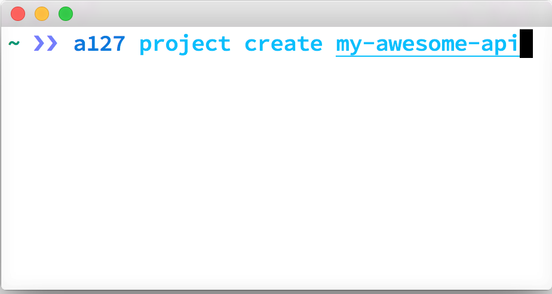

  

    

    

    

      

        <h1>Write node APIs from your laptop</h1>
        
Everything you need to make sure your API is ready for primetime

      

      

        
      

    

  

<nav class="navbar navbar-default navbar-static-top" role="navigation">
  

    

      <button type="button" class="navbar-toggle collapsed" data-toggle="collapse" data-target="#navbar" aria-expanded="false" aria-controls="navbar">
        Toggle navigation
        
        
        
      </button>
      <a class="navbar-brand" href="#">Project name</a>
    

    

      <ul class="nav navbar-nav">
        <li class="active"><a href="#">Home</a></li>
        <li><a href="#about">About</a></li>
        <li><a href="#contact">Contact</a></li>
      </ul>
      <ul class="nav navbar-nav navbar-right">
        <li><a href="../navbar/">Default</a></li>
        <li class="active"><a href="./">Static top</a></li>
        <li><a href="../navbar-fixed-top/">Fixed top</a></li>
      </ul>
    
<!--/.nav-collapse -->
  

</nav>

  contnet!

